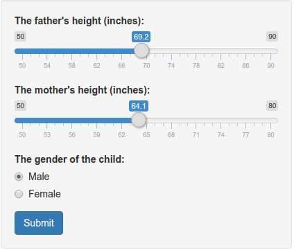
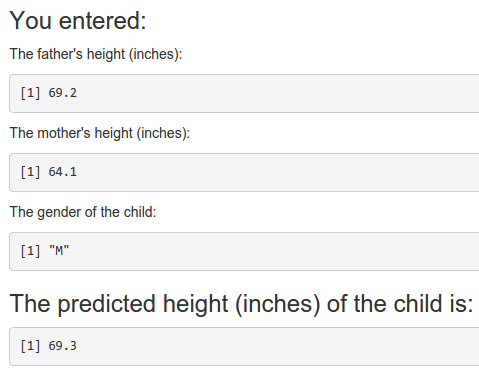

A shiny App to Predict the Height of Child
========================================================
author: LYU Daliang
date: Sept. 23, 2015

Introduction
========================================================

- a shiny app published on `shinyapps.io`:
    - [Predicting the Height of Adult Child](https://lyu-daliang.shinyapps.io/Predicting_Child_Height)
- aims to predict the height of an adult child based on his/her parent's heights and his/her own gender

The Input Interface
========================================================



***

- select the heights (inches) of parents using two sliders (both have limitations)
- specify the gender with a pair of radio buttons (only one can be selected)
- push the submit button

The Output
========================================================



***

- after the submit button pushed, the predicted height (inches) of the adult child is calculated and showed
- what you input are displayed for proofreading purpose

The Back End
========================================================

The back end of this app is the famous 1885 study of Francis Galton exploring the relationship between the heights of adult children and the heights of their parents. Suppose the parents of a boy have the mean heights, the following code chunk will give the prediction of the boy's height when he grows up:


```r
URL <- 'http://www.math.uah.edu/stat/data/Galton.csv'; df <- read.csv(URL)
fit_male <- lm(Height ~ Father + Mother, data = df[df$Gender == 'M', ])
round(predict(fit_male, newdata = data.frame(Father = mean(df$Father), Mother = mean(df$Mother)))[[1]], 1)
```

```
[1] 69.3
```
